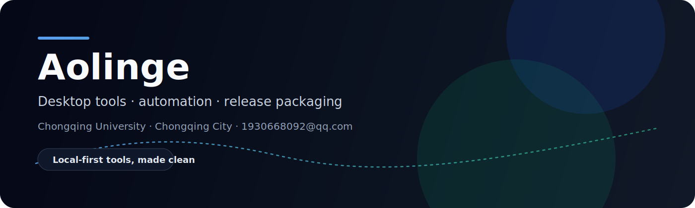

  

  
  
  

  <b>Computer Science student at Chongqing University</b> 
  I build small, dependable tools for agent-era development, local automation, and repeatable releases.

  Languages: English | <a href="README.zh-CN.md">简体中文</a>

---

## Hello, I'm Aolinge

I turn messy workflows into tools that are easy to run again: clear CLIs,
practical backend services, release checklists, and documentation that helps
the next person ship with less friction.

Right now I am focused on three things:

| Direction | What I am building |
| --- | --- |
| Agent safety | Scanners and guardrails for AI coding agents, MCP configs, and local automation repositories. |
| Backend practice | Java / Spring Boot services with clean project structure and delivery notes. |
| Personal systems | Local-first workflows for study, research, releases, backup, and writing. |

## Start Here

If you found me through GitHub search, these are the clearest entry points:

| Need | Start with | First action |
| --- | --- | --- |
| Check an AI-agent or MCP repo before launch | [agent-secret-guard](https://github.com/aolingge/agent-secret-guard) | `npx agent-secret-guard scan . --fail-on high` |
| Produce one report for repo rules, README, CI, secrets, and agent readiness | [agent-reliability-kit](https://github.com/aolingge/agent-reliability-kit) | `npx agent-reliability-kit scan .` |
| Capture a redacted trace of an agent or shell run | [agent-run-trace-pack](https://github.com/aolingge/agent-run-trace-pack) | `npx agent-run-trace-pack run -- npm test` |
| Diagnose MCP config before your AI client fails | [mcp-config-doctor](https://github.com/aolingge/mcp-config-doctor) | `npx mcp-config-doctor --config mcp.json` |
| Browse the portfolio and service landing page | [open-source-portfolio](https://github.com/aolingge/open-source-portfolio) | [Live site](https://aolingge.github.io/open-source-portfolio/) |

Follow this account for small local-first tools that make AI-assisted repositories safer, easier to verify, and easier to release.

## Available For

I am taking a small number of focused launch-readiness audits for AI agent, MCP, GitHub Actions, and local automation repositories.

| Service | What you get | Start here |
| --- | --- | --- |
| AI Agent Repo Safety Audit | 24h Markdown risk summary for MCP args, agent instructions, local credential paths, browser profiles, and CI permissions. | [Service page](https://github.com/aolingge/agent-secret-guard/blob/main/docs/ai-agent-repo-safety-audit.md) |
| Fix PR | A scoped pull request that moves risky examples to safer config patterns after an audit. | [Sample report](https://github.com/aolingge/agent-secret-guard/blob/main/docs/sample-audit-report.md) |
| Local automation hardening | Review of repo docs, workflows, and scripts before public release or client handoff. | [agent-secret-guard](https://github.com/aolingge/agent-secret-guard) |

For a first pass, send a public repo link by email or GitHub. Please do not send production secrets, cookies, private keys, or live credentials.

## Featured Work

### 10 open-source CLIs for AI-agent-era repositories

I just shipped a focused set of small tools for repositories used with Codex, Claude Code, Cursor, MCP servers, and prompt-as-code workflows.

| Tool | First command |
| --- | --- |
| [agent-hardening-kit](https://github.com/aolingge/agent-hardening-kit) | `npx github:aolingge/agent-hardening-kit --path . --markdown` |
| [agent-secret-guard](https://github.com/aolingge/agent-secret-guard) | `npx agent-secret-guard scan . --fail-on high` |
| [agent-run-trace-pack](https://github.com/aolingge/agent-run-trace-pack) | `npx agent-run-trace-pack run -- npm test` |
| [mcp-config-doctor](https://github.com/aolingge/mcp-config-doctor) | `npx mcp-config-doctor --config mcp.json` |
| [mcp-readme-score](https://github.com/aolingge/mcp-readme-score) | `npx github:aolingge/mcp-readme-score --path README.md` |
| [mcp-permission-matrix](https://github.com/aolingge/mcp-permission-matrix) | `npx github:aolingge/mcp-permission-matrix --path README.md` |
| [repo-agent-health](https://github.com/aolingge/repo-agent-health) | `npx github:aolingge/repo-agent-health --path .` |
| [repo-context-pack](https://github.com/aolingge/repo-context-pack) | `npx github:aolingge/repo-context-pack --path .` |
| [oss-readme-check](https://github.com/aolingge/oss-readme-check) | `npx github:aolingge/oss-readme-check --path README.md` |
| [prompt-injection-smoke](https://github.com/aolingge/prompt-injection-smoke) | `npx github:aolingge/prompt-injection-smoke --path prompts/` |
| [skill-md-lint](https://github.com/aolingge/skill-md-lint) | `npx github:aolingge/skill-md-lint --path SKILL.md` |

  <b>Newest:</b>
  <a href="https://github.com/aolingge/agent-run-trace-pack"><b>agent-run-trace-pack</b></a>
  · Redacted trace packs for agent or shell runs, with output, git diff, risk signals, Markdown, and HTML reports.
   
  <code>npx agent-run-trace-pack run -- npm test</code>
   
  <a href="https://github.com/aolingge/mcp-config-doctor"><b>mcp-config-doctor</b></a>
  · Local-first MCP config diagnostics for Claude Desktop, Cursor, Codex, and agent-era developer workflows.
   
  <code>npx mcp-config-doctor --config mcp.json</code>
   
  <a href="https://github.com/aolingge/agent-hardening-kit"><b>agent-hardening-kit</b></a>
  · One-command AI Agent/MCP repository hardening scanner with SARIF, HTML reports, bilingual docs, and CI policy templates.
   
  <code>npx github:aolingge/agent-hardening-kit --path . --markdown</code>
   
  <a href="https://github.com/aolingge/prompt-yaml-lint"><b>prompt-yaml-lint</b></a>
  · Prompt-as-code quality checks for .prompt.yml files.
   
  <code>npx github:aolingge/prompt-yaml-lint review.prompt.yml</code>

<b>AI Agent Mini Tools</b>

 

| Tool | What it checks |
| --- | --- |
| [agent-context-budget](https://github.com/aolingge/agent-context-budget) | Agent context size and useful repo instruction signals |
| [agent-env-redactor](https://github.com/aolingge/agent-env-redactor) | Secret-like values in agent reports and config snippets |
| [mcp-readme-score](https://github.com/aolingge/mcp-readme-score) | MCP README install, config, permissions, and security notes |
| [skill-md-lint](https://github.com/aolingge/skill-md-lint) | AI agent `SKILL.md` trigger, input, output, and safety clarity |
| [agentignore-check](https://github.com/aolingge/agentignore-check) | `.agentignore` rules for private and noisy files |
| [repo-context-pack](https://github.com/aolingge/repo-context-pack) | Compact repo context packs for coding agents |
| [agent-ci-doctor](https://github.com/aolingge/agent-ci-doctor) | CI commands agents can run before finishing |
| [mcp-tool-name-lint](https://github.com/aolingge/mcp-tool-name-lint) | Vague or risky MCP tool names |
| [agent-runbook-check](https://github.com/aolingge/agent-runbook-check) | Debug, verify, rollback, and report runbook coverage |
| [prompt-eval-seed](https://github.com/aolingge/prompt-eval-seed) | Prompt eval seed inputs, expected behavior, edge cases, and safety |
| [agent-pr-brief](https://github.com/aolingge/agent-pr-brief) | Pull request briefs for safer AI code review |
| [mcp-env-template-check](https://github.com/aolingge/mcp-env-template-check) | MCP `.env.example` completeness without real tokens |
| [prompt-injection-smoke](https://github.com/aolingge/prompt-injection-smoke) | Prompt-injection smoke checks for agent workflows |
| [agent-permission-audit](https://github.com/aolingge/agent-permission-audit) | File, shell, browser, network, and secret permission boundaries |
| [readme-demo-link-check](https://github.com/aolingge/readme-demo-link-check) | README demo links, quick starts, screenshots, and mirrors |
| [agent-log-triage](https://github.com/aolingge/agent-log-triage) | Actionable AI agent failure log signals |
| [repo-release-proof](https://github.com/aolingge/repo-release-proof) | Release notes with changes, verification, versions, and mirrors |
| [agent-task-scope](https://github.com/aolingge/agent-task-scope) | Task briefs with scope, acceptance criteria, constraints, and verification |
| [mcp-manifest-lint](https://github.com/aolingge/mcp-manifest-lint) | MCP manifest name, transport, target, and permissions |
| [ai-changelog-guard](https://github.com/aolingge/ai-changelog-guard) | AI-assisted changelog verification and compatibility notes |
| [agent-windows-path-doctor](https://github.com/aolingge/agent-windows-path-doctor) | Check AI-agent task files for Windows path, WSL path, quoting, and cross-platform command risks. |
| [agent-shell-safety-check](https://github.com/aolingge/agent-shell-safety-check) | Check agent runbooks for shell command scope, verification, and destructive-operation boundaries. |
| [mcp-permission-matrix](https://github.com/aolingge/mcp-permission-matrix) | Check MCP server docs for a clear tool, permission, data-scope, and risk matrix. |
| [prompt-regression-report](https://github.com/aolingge/prompt-regression-report) | Check prompt regression reports for input, expected output, actual output, diffs, and decisions. |
| [repo-agent-health](https://github.com/aolingge/repo-agent-health) | Check whether a repository exposes the basic health signals an AI coding agent needs. |
| [agent-tool-risk-score](https://github.com/aolingge/agent-tool-risk-score) | Score file, shell, network, browser, and secret risks in AI-agent tool lists. |
| [mcp-server-smoke-test](https://github.com/aolingge/mcp-server-smoke-test) | Check MCP server smoke-test docs for startup, tool listing, sample calls, and failure handling. |
| [readme-install-replay](https://github.com/aolingge/readme-install-replay) | Check README install steps for copy-ready prerequisites, commands, and verification output. |
| [ci-command-harvest](https://github.com/aolingge/ci-command-harvest) | Check repo docs for test, build, lint, and verification commands agents can safely run. |
| [agent-memory-audit](https://github.com/aolingge/agent-memory-audit) | Check AI memory or rule files for trigger conditions, behavior, exceptions, and secret boundaries. |
| [release-mirror-check](https://github.com/aolingge/release-mirror-check) | Check release records for GitHub, Gitee, tag, release, and verification evidence. |
| [prompt-fixture-pack](https://github.com/aolingge/prompt-fixture-pack) | Check prompt fixture packs for happy path, edge, failure, safety, and expected-output cases. |
| [agent-context-diff](https://github.com/aolingge/agent-context-diff) | Check agent context diff notes for additions, removals, risks, verification, and scope. |
| [repo-onboarding-check](https://github.com/aolingge/repo-onboarding-check) | Check whether new contributors can find install, run, test, contribute, and support paths. |
| [ai-pr-risk-labeler](https://github.com/aolingge/ai-pr-risk-labeler) | Check PR descriptions for enough evidence to label AI-assisted change risk. |

<table>
  <tr>
    <td width="50%" valign="top">
      <h3>student-deploy-kit</h3>
      
A beginner-friendly deployment toolkit for students and indie developers: Nginx configs, Spring Boot systemd scripts, frontend deployment, Docker Compose, VPS security, and troubleshooting docs.

      

        <a href="https://github.com/aolingge/student-deploy-kit"><b>Repository</b></a>
        ·
        <a href="https://github.com/aolingge/student-deploy-kit/releases/tag/v0.1.0"><b>Release</b></a>
      

      
<code>bash scripts/validate.sh</code>

      

        
        
        
      

    </td>
    <td width="50%" valign="top">
      <h3>open-source-portfolio</h3>
      
A deployment-first open source portfolio template for students and independent developers, published with GitHub Pages and tuned for project proof over decoration.

      

        <a href="https://github.com/aolingge/open-source-portfolio"><b>Repository</b></a>
        ·
        <a href="https://aolingge.github.io/open-source-portfolio/"><b>Live site</b></a>
      

      

        
        
        
      

    </td>
  </tr>
  <tr>
    <td width="50%" valign="top">
      <h3>oss-readme-check</h3>
      
A zero-dependency CLI that audits whether a README is ready for an open-source launch: quick start, visual anchor, multilingual entry, contribution path, security boundary, and first-success verification.

      

        <a href="https://github.com/aolingge/oss-readme-check"><b>Repository</b></a>
        ·
        <a href="https://github.com/aolingge/oss-readme-check/releases/tag/v0.1.0"><b>Release</b></a>
      

      
<code>npx oss-readme-check --path README.md</code>

      

        
        
        
      

    </td>
    <td width="50%" valign="top">
      <h3>vps-deploy-doctor</h3>
      
Read-only VPS deployment diagnostics for Nginx, systemd, ports, Docker, firewall, disk, memory, and logs. Built for student projects that fail at the final deployment step.

      

        <a href="https://github.com/aolingge/vps-deploy-doctor"><b>Repository</b></a>
        ·
        <a href="https://github.com/aolingge/vps-deploy-doctor/releases/tag/v0.1.0"><b>Release</b></a>
      

      
<code>bash bin/vps-deploy-doctor.sh --service demo-api</code>

      

        
        
        
      

    </td>
  </tr>
  <tr>
    <td width="50%" valign="top">
      <h3>agent-secret-guard</h3>
      
A 5-minute safety check for agent-era repositories. It catches MCP tokens in args, broad filesystem access, browser profile exposure, risky automation notes, and over-permissive GitHub Actions workflows.

      

        <a href="https://github.com/aolingge/agent-secret-guard"><b>Repository</b></a>
        ·
        <a href="https://aolingge.dev/agent-secret-guard/"><b>Landing page</b></a>
        ·
        <a href="https://www.npmjs.com/package/agent-secret-guard"><b>npm</b></a>
        ·
        <a href="https://github.com/aolingge/agent-secret-guard-action"><b>GitHub Action</b></a>
      

      
<code>npx agent-secret-guard scan . --fail-on high</code>

      

        
        
        
      

    </td>
    <td width="50%" valign="top">
      <h3>express-locker-backend</h3>
      
A Java / Spring Boot backend for express locker logistics scenarios, focused on service structure, API design, and database-oriented delivery practice.

      

        <a href="https://github.com/aolingge/express-locker-backend"><b>Repository</b></a>
      

      

        
        
        
      

    </td>
  </tr>
  <tr>
    <td width="50%" valign="top">
      <h3>TrendRadar</h3>
      
A Python toolkit for tracking hot topics across platforms, aggregating trend signals, and turning noisy feeds into readable AI-assisted summaries.

      

        <a href="https://github.com/aolingge/TrendRadar"><b>Repository</b></a>
      

      

        
        
        
      

    </td>
    <td width="50%" valign="top">
      <h3>Project factory</h3>
      
A local workflow for creating, packaging, documenting, and iterating public GitHub projects while keeping drafts, release kits, and private notes out of real repositories.

      

        <a href="https://github.com/aolingge"><b>Project index</b></a>
      

      

        
        
        
      

    </td>
  </tr>
</table>

## Toolbox

  
  
  
  
  
  
  
  

## How I Work

- Make the first run boring: short commands, clear defaults, and fewer hidden steps.
- Write docs as part of the product, not as a cleanup chore at the end.
- Keep local workflows safe around credentials, browser profiles, and agent permissions.
- Package releases so future maintenance is easier than the first launch.

## GitHub Snapshot

  <picture>
    <source
      srcset="https://github-readme-stats.vercel.app/api?username=aolingge&show_icons=true&hide_border=true&theme=github_dark&rank_icon=github&include_all_commits=true"
      media="(prefers-color-scheme: dark)"
    />
    <source
      srcset="https://github-readme-stats.vercel.app/api?username=aolingge&show_icons=true&hide_border=true&theme=default&rank_icon=github&include_all_commits=true"
      media="(prefers-color-scheme: light), (prefers-color-scheme: no-preference)"
    />
    
  </picture>
  <picture>
    <source
      srcset="https://github-readme-stats.vercel.app/api/top-langs/?username=aolingge&layout=compact&hide_border=true&theme=github_dark"
      media="(prefers-color-scheme: dark)"
    />
    <source
      srcset="https://github-readme-stats.vercel.app/api/top-langs/?username=aolingge&layout=compact&hide_border=true&theme=default"
      media="(prefers-color-scheme: light), (prefers-color-scheme: no-preference)"
    />
    
  </picture>

---

  <b>Make it clean. Make it reusable. Make it easy to ship.</b> 
  Chongqing City · Chongqing University · open-source notes, tools, and experiments

